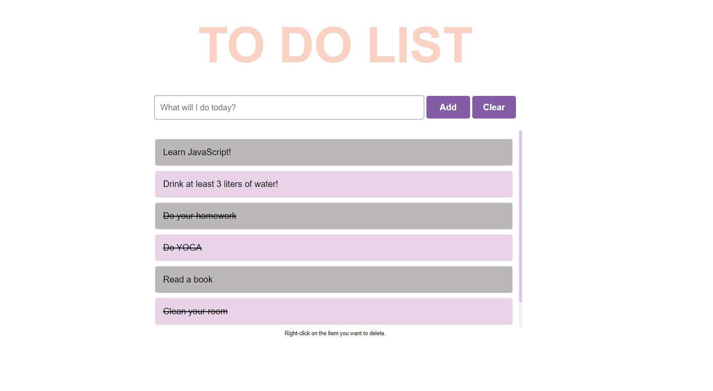
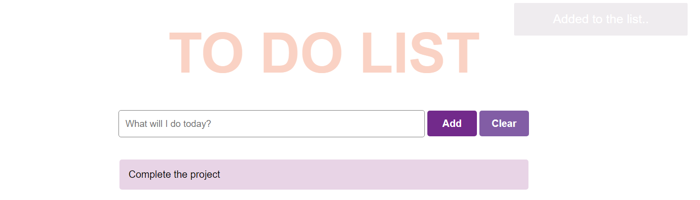

# to do list

###### It's a to-do project that writes down elements you want to do and adds them to the list and keeps it in local storage. You can add element with the "Add" button or delete all the elements with the "Clear" button. You can use right click if you want to delete items one by one, or left click if you want to mark them as complete.

--------------------------------------------------------------------------------------------------------------------------------------------------------------------

